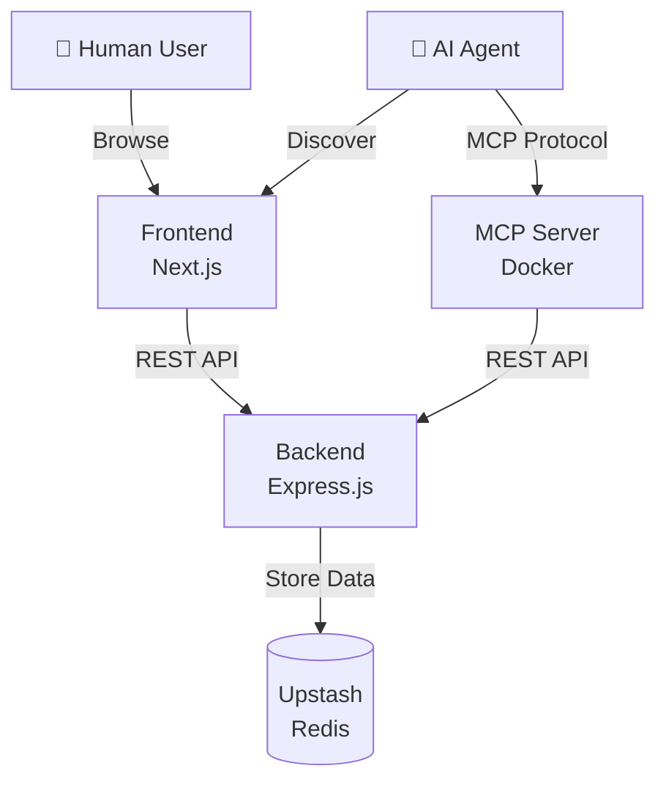
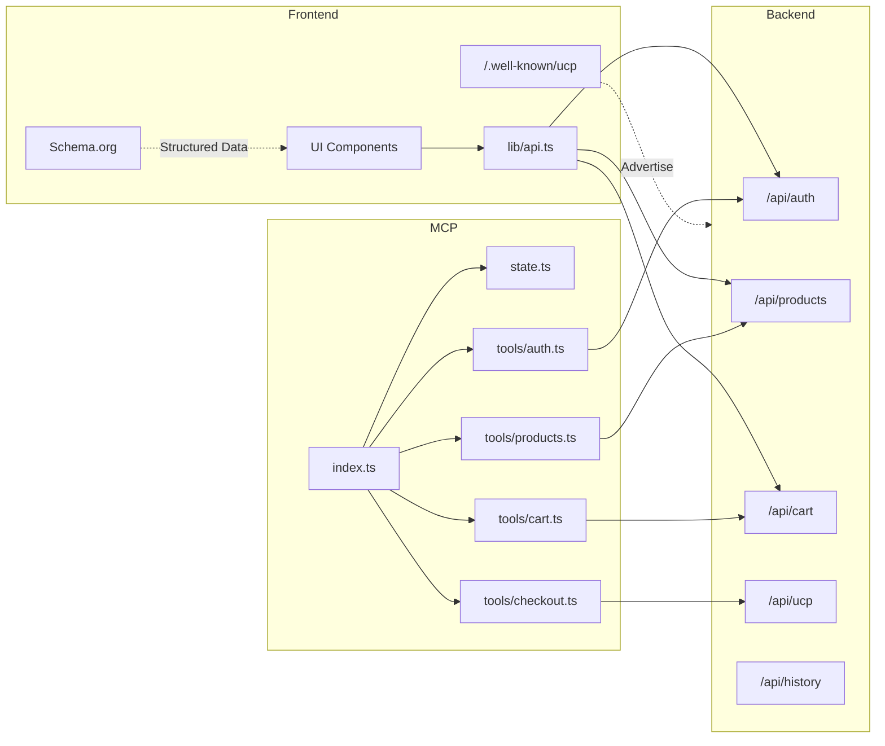

# Yama UCP Store - Architecture & Design Principles

## 概要

このプロジェクトは、**UCP (Universal Checkout Protocol)** に準拠した E コマースプラットフォームです。人間向けの Web UI と AI エージェント向けの MCP インターフェースの両方を提供します。

---

## アーキテクチャ図

### システム全体構成



### 詳細コンポーネント図



---

## ディレクトリ構成

```
yama-ucp-store/
├── packages/
│   ├── frontend/          # Next.js フロントエンド
│   │   ├── src/
│   │   │   ├── app/
│   │   │   │   ├── .well-known/ucp/  # UCP Discovery
│   │   │   │   ├── products/         # 商品ページ (Schema.org)
│   │   │   │   ├── cart/             # カート
│   │   │   │   └── checkout/         # チェックアウト
│   │   │   ├── components/           # UI コンポーネント
│   │   │   └── lib/                  # API クライアント
│   │   └── package.json
│   │
│   ├── backend/           # Express.js バックエンド
│   │   ├── src/
│   │   │   ├── routes/
│   │   │   │   ├── auth.ts           # 認証 API
│   │   │   │   ├── products.ts       # 商品 API
│   │   │   │   ├── cart.ts           # カート API
│   │   │   │   ├── ucp.ts            # UCP 準拠 API
│   │   │   │   └── history.ts        # 購入履歴 API
│   │   │   ├── stores/
│   │   │   │   └── upstashStore.ts   # Redis データストア
│   │   │   ├── types.ts              # 型定義
│   │   │   └── index.ts              # エントリーポイント
│   │   └── package.json
│   │
│   └── mcp-server/        # MCP サーバー (AI 向け)
│       ├── src/
│       │   ├── tools/
│       │   │   ├── index.ts          # ツール登録
│       │   │   ├── auth.ts           # 認証ツール
│       │   │   ├── products.ts       # 商品検索ツール
│       │   │   ├── cart.ts           # カートツール
│       │   │   └── checkout.ts       # 決済ツール
│       │   ├── state.ts              # 状態管理
│       │   └── index.ts              # MCP サーバー本体
│       ├── Dockerfile                # Docker 設定
│       └── package.json
│
├── ARCHITECTURE.md        # このファイル
└── README.md
```

---

## 設計方針

### 1. **UCP First Design**

- **フロントエンドが起点**: AI エージェントは `/.well-known/ucp` から発見を開始
- **バックエンドが API を提供**: UCP 準拠の `/api/ucp` エンドポイントを実装
- **MCP はアダプター**: AI と UCP バックエンドを橋渡しする中間層

### 2. **関心の分離 (Separation of Concerns)**

| レイヤー | 責務 |
|---------|------|
| **Frontend** | 人間向け UI、Schema.org マークアップ、UCP Discovery |
| **Backend** | ビジネスロジック、データ永続化、RESTful API |
| **MCP Server** | AI エージェント向けツール定義、セッション管理 |

### 3. **モジュラー設計**

- **Backend**: 機能ごとにルーターを分割 (`auth`, `products`, `cart`, `ucp`, `history`)
- **MCP Server**: ツールを機能別ファイルに分割し、`tools/index.ts` で一元管理
- **拡張性**: 新機能追加時は該当ディレクトリに新ファイルを追加するだけ

### 4. **API 設計原則**

#### RESTful API (Backend)
- `GET /api/products`: 商品一覧取得
- `GET /api/products/:id`: 商品詳細取得
- `POST /api/cart`: カートに追加
- `POST /api/ucp/checkout-sessions`: チェックアウトセッション作成
- `POST /api/ucp/checkout-sessions/:id/complete`: 購入完了

#### UCP 準拠
- チェックアウトフローは UCP 仕様に準拠
- `/.well-known/ucp` で API エンドポイントを公開

### 5. **認証・セキュリティ**

- **現状**: JWT ベースの認証（username/password）
- **将来**: OAuth 2.0 Device Flow への移行を検討
- **MCP Server**: セッショントークンをメモリ内で管理（Docker コンテナのライフサイクル内）

### 6. **データフロー**

#### 人間ユーザーの購入フロー
```
1. Frontend で商品閲覧
2. カートに追加 → Backend /api/cart
3. チェックアウト → Backend /api/ucp/checkout-sessions
4. 購入完了 → Backend /api/ucp/checkout-sessions/:id/complete
```

#### AI エージェントの購入フロー
```
1. /.well-known/ucp で API 発見
2. MCP Server 経由でログイン → Backend /api/auth/login
3. 商品検索 → Backend /api/products
4. カート追加 → Backend /api/cart
5. 配送先設定 → MCP Server のメモリ
6. チェックアウト → Backend /api/ucp/checkout-sessions
7. 購入完了 → Backend /api/ucp/checkout-sessions/:id/complete
```

### 7. **デプロイ戦略**

- **Frontend**: Vercel (Next.js)
- **Backend**: Vercel Serverless Functions
- **MCP Server**: Docker (ローカル実行、Claude Desktop と連携)

---

## 技術スタック

| コンポーネント | 技術 |
|--------------|------|
| Frontend | Next.js 15, React, TypeScript, Tailwind CSS |
| Backend | Express.js, TypeScript, Upstash Redis |
| MCP Server | Node.js, TypeScript, MCP SDK, tsx (実行時) |
| 認証 | JWT (将来: OAuth 2.0) |
| データストア | Upstash Redis |
| デプロイ | Vercel (Frontend/Backend), Docker (MCP) |

---

## 今後の拡張計画

### Phase 1: 認証強化
- OAuth 2.0 Device Flow の実装
- SSO 対応

### Phase 2: UCP 機能拡張
- Fulfillment (配送管理) 機能
- Discount (割引・クーポン) 機能
- 電子署名 (signing_keys) の実装

### Phase 3: MCP の高度化
- バックエンドに MCP エンドポイントを統合（別サーバー不要に）
- 動的ツール生成（OpenAPI から自動生成）

---

## 変更管理ルール

### 構造変更時の手順

1. **このファイル (ARCHITECTURE.md) を更新**
   - アーキテクチャ図の修正
   - 設計方針の追加・変更
   - ディレクトリ構成の更新

2. **レビュー依頼**
   - 変更内容をユーザーに提示
   - 承認を得る

3. **実装**
   - 承認後にコード変更を実施
   - `task.md` と `implementation_plan.md` を更新

4. **検証**
   - テスト実施
   - `walkthrough.md` に結果を記録

### 日常的な開発フロー

- **新機能追加**: 該当モジュールに新ファイルを追加
- **バグ修正**: 影響範囲を最小限に
- **リファクタリング**: 設計方針に沿って実施

---

## 参考リンク

- [UCP Specification](https://ucp.dev/specification/overview)
- [MCP Documentation](https://modelcontextprotocol.io/)
- [Schema.org Product](https://schema.org/Product)
